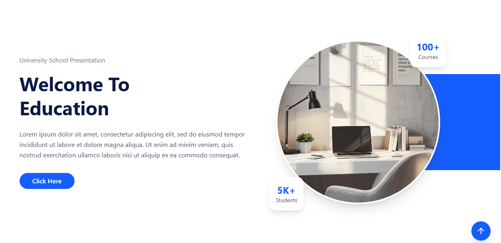
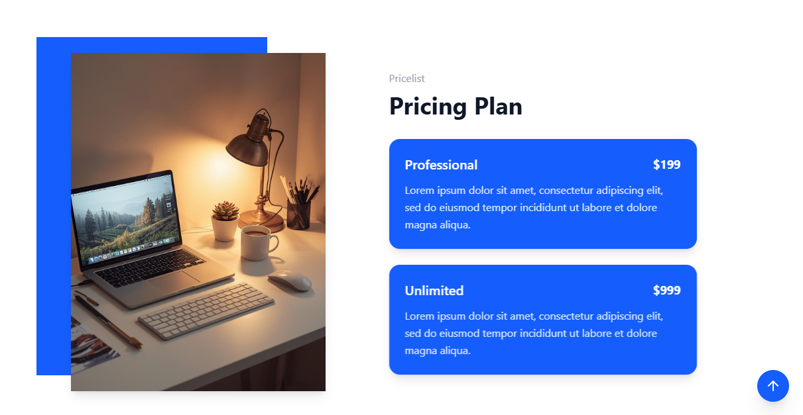

**# React + Vite

🎓 Education Website

A modern and responsive education platform built using React and Tailwind CSS. This project provides a clean UI and smooth user experience for showcasing courses and educational content.

🚀 Live Demo

👉 https://your-website-link.vercel.app

📸 Screenshots
### 🏠 Home Page

### 📚 About  Section

### 📱 Education

### 📱 Pricing plan

✨ Features
*Fully responsive design (Mobile + Desktop)
*Modern UI with Tailwind CSS
*Reusable React components
*Fast performance with Vite
*Clean and structured code

🛠️ Tech Stack
*React JS
*Tailwind CSS
*JavaScript (ES6+)
*Vite

⚙️ Installation & Setup
git clone https://github.com/your-username/education-website.git
cd education-website
npm install
npm run dev
📦 Build for Production
npm run build

🙌 Author
Tanzeel Khan
GitHub: https://github.com/twniazi
⭐ Support

If you like this project, give it a ⭐ on GitHub!
